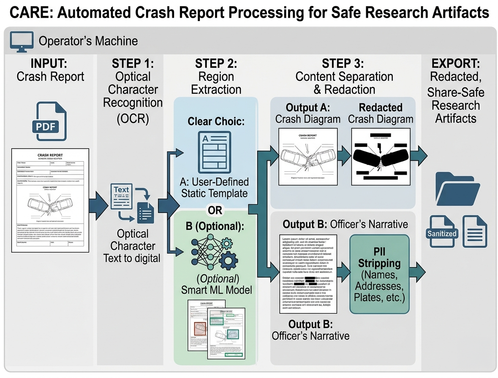

<div align="center">


Privacy-safe extraction of crash diagrams and narratives from police crash report PDFs for open transportation research.

[](https://github.com/AhmedAredah/care/actions/workflows/governance.yml)
[](https://github.com/AhmedAredah/care/actions/workflows/windows-tests.yml)
[](LICENSE)
[](https://www.python.org/downloads/)
[](docs/offline-mode.md)
[](docs/security.md)

[Documentation](docs/) · [Security](SECURITY.md) · [Contributing](CONTRIBUTING.md)

</div>

---

## What CARE does

<div align="center">
  
</div>

CARE turns piles of police crash report PDFs into structured, **redacted** research artifacts:

1. **Ingests** PDFs and scanned images, hashes every input, never modifies originals.
2. **Detects** the report template (state-and-version specific YAML).
3. **Extracts** the crash diagram (cropped image) and the officer's narrative (text + structured fields).
4. **Redacts** every PII shape it finds — names, addresses, phones, VINs, plates, DOBs, license numbers, signatures, medical info. The default chain is `regex` only; operators add Presidio and ML providers (Piiranha, RoBERTa-NER, OpenAI Privacy Filter) opt-in after license review.
5. **Exports** only the safe artifacts (redacted diagram, redacted narrative, manifests, QA report). Originals never leave the working directory.

If anything is unclear — unknown template, low OCR confidence, VLM output that doesn't agree with OCR, PII the redactor can't map back to image pixels — **the export is blocked** and the job is flagged for human review.

## Why CARE exists

Transportation researchers, DOTs, and university traffic safety programs need access to crash narratives and diagrams to study near-misses, infrastructure issues, and emerging crash patterns. The reports they need are full of personally identifying information that must never escape the agency. Today this means hand-redacting every page — slow, expensive, and inconsistent.

CARE is built so that **the safe path is the default path**:

- **Offline-first** — no telemetry, no analytics, no auto-update, no CDN, no cloud calls in the default config. Hugging Face/Transformers loads only from local model files. The runtime can be air-gapped end-to-end.
- **Plugin-based** — every OCR engine, PII detector, and document-AI model is a plugin behind a stable interface. Operators choose what to enable; nothing is hard-coded. The Plugins page shows per-provider accuracy with a tier badge (A = project benchmark, B = published in-domain, C = vendor / unverified) so claims can't outrank evidence.
- **Fail-closed** — uncertainty blocks export. Better to surface a job for review than ship a leaky redaction.
- **Auditable** — model checksums, SBOM, immutable policy guard, every plugin enable/disable logged.
- **Native desktop app** — pywebview-wrapped FastAPI. No browser tab, no localhost copy-paste; just a Start Menu shortcut.

## Quick start

### Install (Windows)

Download the installer for your environment from the [Releases page](https://github.com/AhmedAredah/care/releases):

| Variant | When to use |
|---|---|
| `CARE-*-core-online-Setup.exe` | **Default.** Slim install (~120 MB), connected workstation. |
| `CARE-*-core-airgap-Setup.exe` | Slim install, air-gapped or restricted-network host. |
| `CARE-*-ml-online-Setup.exe`   | Bundles `torch` + `transformers` so HF plugins (Piiranha, RoBERTa-NER, OpenAI Privacy Filter, Kosmos-2.5, LayoutLM) can run. **Model weights are not included** — drop them into `%LOCALAPPDATA%\CARE\models\` per [`docs/license-and-model-governance.md`](docs/license-and-model-governance.md). |
| `CARE-*-ml-airgap-Setup.exe`   | Same ML libraries, bundled WebView2 runtime for offline hosts. |
| `CARE-*-core.msi`              | Enterprise SCCM/Intune deployment, slim. |
| `CARE-*-ml.msi`                | Enterprise SCCM/Intune deployment, ML libraries. |

Code signing for Windows binaries is provided free of charge by the [SignPath Foundation](https://signpath.io/foundation), the OSS code-signing program. Enrolment is in progress; alpha binaries are unsigned in the meantime. See the [release notes](https://github.com/AhmedAredah/care/releases) for SmartScreen / Mark-of-the-Web handling and SHA-256 verification before installing.

See [`docs/deployment-windows.md`](docs/deployment-windows.md) for the full deployment guide.

> **Planned** — the `ml` SKU is being split into per-plugin bundles (one core installer + opt-in `pii-ml`, `vlm`, `ocr-traditional`, `presidio`, `llm-local`, `llm-cloud`). Each bundle ships its own model weights inline and is signed independently, so operators only download what they're licensed to deploy. License-review-required bundles (`pii-ml`, `vlm`) gate at install time. Tracking issue and migration notes will land before the cutover.

### Pre-stage model weights (ML installs)

The `ml-*` installers bundle the runtime to load Hugging Face models but never the weights themselves. Drop each model's checkpoint into its own subdirectory under the user-data tree before enabling the plugin in Settings:

```
%LOCALAPPDATA%\CARE\models\<group>\<provider>\
```

| Plugin | Source | License |
|---|---|---|
| `piiranha` (PII) | [`iiiorg/piiranha-v1-detect-personal-information`](https://huggingface.co/iiiorg/piiranha-v1-detect-personal-information) | CC BY-NC-ND 4.0 — license review required |
| `roberta_ner` (PII) | [`Jean-Baptiste/roberta-large-ner-english`](https://huggingface.co/Jean-Baptiste/roberta-large-ner-english) | MIT |
| `openai_privacy_filter` (PII) | [`openai/privacy-filter`](https://huggingface.co/openai/privacy-filter) | Apache-2.0 |
| `kosmos25` (document-AI) | [`microsoft/kosmos-2.5`](https://huggingface.co/microsoft/kosmos-2.5) | see model card |
| `layoutlm` (document-AI) | [`microsoft/layoutlm-base-uncased`](https://huggingface.co/microsoft/layoutlm-base-uncased) (v1) | MIT — v3 is CC BY-NC-SA 4.0 (non-commercial) |
| `onnxtr` (OCR) | [OnnxTR GitHub releases](https://github.com/felixdittrich92/OnnxTR/releases) | Apache-2.0 |

**Option A — `huggingface-cli` (connected host):**

```powershell
pip install -U "huggingface_hub[cli]"
huggingface-cli download openai/privacy-filter `
    --local-dir "$env:LOCALAPPDATA\CARE\models\pii\openai-privacy-filter"
```

Substitute the repo ID and `<group>\<provider>` subdirectory for each plugin you intend to enable. The per-provider `models/<group>/<provider>/README.md` files in this repo list the exact filenames and any `--include` filters that skip multi-GB extras you don't need.

**Option B — Direct download:** open the model's Hugging Face **Files and versions** tab (or the OnnxTR GitHub release) and save every file listed in the per-provider README into the target subdirectory above. For air-gapped hosts, fetch on a connected workstation and copy the directory tree across, preserving layout.

After staging, verify with `care model-manifest --models-dir "$env:LOCALAPPDATA\CARE\models"` — each provider you've populated should report `model_path_present: true`. Optionally pin integrity hashes with `care compute-model-checksums "$env:LOCALAPPDATA\CARE\models\<group>\<provider>"`. Read [`docs/license-and-model-governance.md`](docs/license-and-model-governance.md) **before** flipping any provider to `enabled: true`.

### Install (from source, any OS)

```bash
# Requires Python 3.11+ and uv (https://docs.astral.sh/uv/)
git clone https://github.com/AhmedAredah/care
cd care
uv sync                      # core install
uv sync --extra ml           # add ML dependencies (optional)
uv run care app              # launch the desktop GUI
```

### Run from the CLI

```bash
care app                                     # desktop GUI
care serve --host 127.0.0.1 --port 7860      # headless server
care process /path/to/reports                # batch processing
care list-plugins                            # show registered providers
care verify-offline                          # confirm no network paths
care validate-template templates/example_state/example_template_v1.yaml
```

## Choosing an OCR engine

**TL;DR — OnnxTR is the recommended engine** for printed/scanned crash report forms. It's not "on by default" out of the box (no engine is — CARE ships with `mock_ocr` so the demo runs without model files); enable it in `config.yaml` after dropping the two ONNX weight files into `models/ocr/onnxtr/` (see [`docs/license-and-model-governance.md`](docs/license-and-model-governance.md)).

Crash reports are *scanned printed forms*, sometimes with a *handwritten* officer narrative. Independent benchmarks (e.g. [this one](https://ai.gopubby.com/i-tested-5-ocr-models-on-6-real-world-datasets-heres-which-one-you-should-actually-use-50badae3c16d) on FUNSD/IAM/SROIE) rank the engines roughly like this for our document type:

| Engine | Best at | Use it when |
|---|---|---|
| **OnnxTR** *(recommended)* | Printed forms, degraded scans | Default choice. Best on FUNSD-style forms, best on noisy scans, no PyTorch dependency, ~400 MB. |
| Tesseract | Mediocre everywhere | You need a system-wide binary already installed and don't care about peak accuracy. |
| PaddleOCR | Receipts, scene text | Don't. Catastrophic on noisy scans (≈3 % accuracy). Stays in the registry only for parity. |

If your inputs are clean digital PDFs with a real text layer, CARE skips OCR entirely and reads the native text — no engine choice needed.

## Documentation

| Topic | Document |
|---|---|
| Architecture | [`docs/architecture.md`](docs/architecture.md) |
| Plugin system | [`docs/plugin-system.md`](docs/plugin-system.md) |
| Offline mode | [`docs/offline-mode.md`](docs/offline-mode.md) |
| No-network guarantee | [`docs/no-network-guarantee.md`](docs/no-network-guarantee.md) |
| Document-AI plugins | [`docs/document-ai-plugins.md`](docs/document-ai-plugins.md) |
| PII policy | [`docs/pii-policy.md`](docs/pii-policy.md) |
| Redaction | [`docs/redaction.md`](docs/redaction.md) |
| Template authoring | [`docs/template-authoring.md`](docs/template-authoring.md) |
| Evaluation | [`docs/evaluation.md`](docs/evaluation.md) |
| Security | [`docs/security.md`](docs/security.md) |
| Deployment (Linux/macOS) | [`docs/deployment.md`](docs/deployment.md) |
| Deployment (Windows) | [`docs/deployment-windows.md`](docs/deployment-windows.md) |
| Packaging | [`docs/packaging.md`](docs/packaging.md) |
| License & model governance | [`docs/license-and-model-governance.md`](docs/license-and-model-governance.md) |

## What CARE is **not**

CARE is *not* a crash-database scraper, an analytics dashboard, or a public web service. It runs on a single workstation and writes redacted artifacts you then move into your own research pipeline.

CARE is *not* a privacy-by-magic tool. The fail-closed gate exists because PII detection is imperfect; CARE refuses to ship a "good enough" redaction. Operators always own the final review.

CARE is *not* a substitute for legal review. Read [`docs/license-and-model-governance.md`](docs/license-and-model-governance.md) before enabling any optional model.

## Status

Pre-1.0. Core invariants — offline-first, fail-closed, plugin-based, no original PDFs in public exports — are stable. The API and CLI surface may still change.

## Contributing

We welcome contributions. See [`CONTRIBUTING.md`](CONTRIBUTING.md) for the workflow and [`SECURITY.md`](SECURITY.md) for vulnerability reporting.

## License

[Apache-2.0](LICENSE) — for the code we wrote. Optional models and dependencies carry their own licences; see [`docs/license-and-model-governance.md`](docs/license-and-model-governance.md) before enabling any of them.

---

<div align="center">
<sub>Built for transportation researchers who care about privacy.</sub>
</div>
